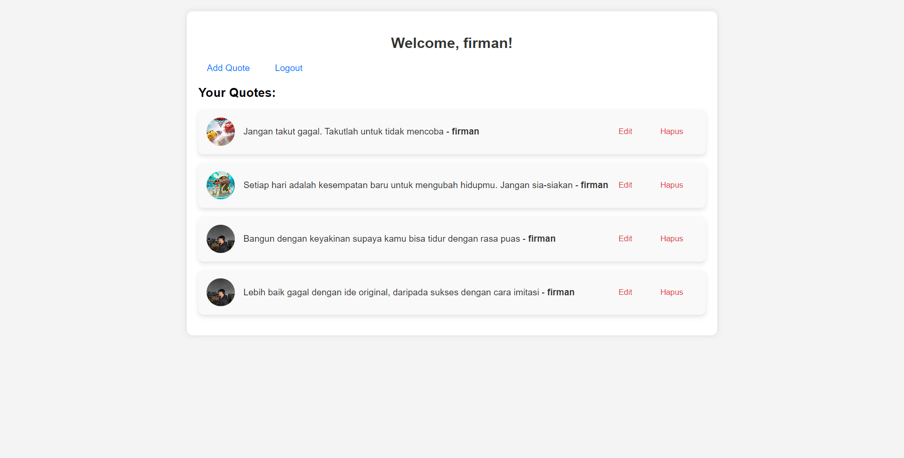

# Quote of the Day

"Quote of the Day" adalah sebuah aplikasi web yang memungkinkan pengguna untuk menambahkan, mengedit, menghapus, dan melihat kutipan inspiratif. Aplikasi ini dirancang dengan menggunakan HTML, CSS, PHP, dan MySQL. Selain itu, aplikasi ini juga memiliki fitur untuk mengunggah foto yang terkait dengan kutipan dan sistem login untuk pengguna.

## Fitur Utama:
1. ### Sistem Login dan Registrasi:
- Pengguna dapat mendaftar menggunakan username untuk membuat akun.
- Setelah mendaftar, pengguna dapat masuk untuk mengakses fitur aplikasi.
- Setiap kutipan yang ditambahkan akan menampilkan nama pengguna yang menambahkannya.

2. ### CRUD (Create, Read, Update, Delete):
- Tambah Kutipan: Pengguna dapat menambahkan kutipan baru beserta foto yang relevan. Nama pengguna akan otomatis muncul bersama kutipan.

- Lihat Kutipan: Pengguna dapat melihat semua kutipan yang telah ditambahkan dalam bentuk daftar, termasuk username yang menambahkannya.

- Edit Kutipan: Pengguna dapat mengedit kutipan yang telah ada untuk memperbarui informasi atau memperbaiki kesalahan.

- Hapus Kutipan: Pengguna dapat menghapus kutipan yang tidak lagi diperlukan.

3. ### Unggah Foto:

- Pengguna dapat memilih dan mengunggah foto yang terkait dengan kutipan menggunakan fitur "Choose File" pada form penambahan kutipan.
- Foto yang diunggah akan ditampilkan bersama dengan kutipan di halaman utama.

4. ### Penggunaan Database:

- Data kutipan dan pengguna disimpan dalam database MySQL, yang memungkinkan penyimpanan dan pengelolaan data yang efisien.

## Teknologi yang Digunakan:

- HTML: Struktur dasar halaman web.

- CSS: Gaya dan tata letak untuk meningkatkan tampilan aplikasi.

- PHP: Backend untuk menangani logika aplikasi, termasuk CRUD dan autentikasi pengguna.

- MySQL: Database untuk menyimpan data kutipan dan pengguna.

## Instalasi:

1. Kloning repositori ini ke komputer Anda.

2. Buat database baru di MySQL dan import file SQL yang disediakan (jika ada).

3. Sesuaikan konfigurasi database pada file koneksi (misalnya, db.php) dengan detail server MySQL Anda.

4. Jalankan aplikasi di server lokal (misalnya XAMPP).

